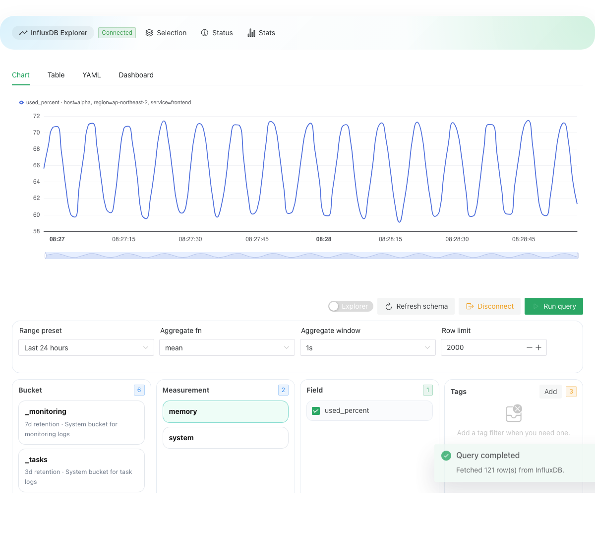

# Influx Vue

`influx-vue` is a Vue 3 + TypeScript workbench for exploring InfluxDB from the UI, switching into raw Flux when needed, and turning query results into charts, tables, and YAML snapshots.

## Try The Sample Page

The sample page is the fastest way to understand the component.



```bash
pnpm install
pnpm db:up
pnpm db:seed
pnpm dev
```

Open the Vite URL shown in the terminal. The sample page auto-fills a local demo connection and auto-connects when the local InfluxDB container is running.

Local demo credentials:

- `URL`: the same origin as the app, for example `http://localhost:5173`
- `Org`: `influx-vue`
- `Bucket`: `demo-metrics`
- `Token`: `influx-vue-admin-token`
- `Username`: `influx`
- `Password`: `influx-password-123`

Notes:

- The dev and preview servers proxy `/api` to the local InfluxDB container.
- Token auth works directly against the component.
- Username/password auth signs in through the current app origin, issues a token from the active session, and then uses that token for the workbench.

To reset the local demo data:

```bash
pnpm db:down
pnpm db:up
pnpm db:seed
```

## What It Does

- Explore `bucket -> measurement -> field -> tags` without starting from Flux.
- Toggle between explorer-driven query building and raw Flux editing.
- Auto-complete Flux from the current schema context.
- Visualize results in a chart or table.
- Export the current state as YAML.
- Run against a real InfluxDB container in integration tests.

## Install

```bash
pnpm add influx-vue
```

```ts
import { InfluxWorkbench } from 'influx-vue'
import 'influx-vue/style.css'
```

`influx-vue` expects Vue 3.5+ in the host app.

## Basic Usage

Token-based initialization:

```vue
<script setup lang="ts">
import { InfluxWorkbench } from 'influx-vue'

const initialConnection = {
  url: window.location.origin,
  org: 'influx-vue',
  bucket: 'demo-metrics',
  authMethod: 'token' as const,
  token: 'influx-vue-admin-token',
}
</script>

<template>
  <InfluxWorkbench
    :initial-connection="initialConnection"
    auto-connect
    auto-run-query
  />
</template>
```

Username/password initialization:

```vue
<script setup lang="ts">
import { InfluxWorkbench } from 'influx-vue'

const initialConnection = {
  url: window.location.origin,
  org: 'influx-vue',
  bucket: 'demo-metrics',
  authMethod: 'password' as const,
  username: 'influx',
  password: 'influx-password-123',
}
</script>

<template>
  <InfluxWorkbench
    :initial-connection="initialConnection"
    auto-connect
  />
</template>
```

If you want to own the auth handshake yourself, you can override it:

```vue
<script setup lang="ts">
import { InfluxWorkbench } from 'influx-vue'

async function authenticateConnection(config) {
  return {
    ...config,
    authMethod: 'token',
    token: await fetchMyToken(config),
  }
}
</script>

<template>
  <InfluxWorkbench
    :initial-connection="{ url: window.location.origin, org: 'influx-vue' }"
    :authenticate-connection="authenticateConnection"
  />
</template>
```

## Public API

### Props

| Prop | Type | Description |
| --- | --- | --- |
| `initialConnection` | `Partial<InfluxConnectionConfig>` | Prefills the connection state before the workbench connects. Supports both token and username/password auth fields. |
| `autoConnect` | `boolean` | Attempts to connect on mount. |
| `autoRunQuery` | `boolean` | Runs the current query after a successful auto-connect. |
| `hiddenSections` | `InfluxWorkbenchSectionKey[]` | Hides top-level sections such as `hero`, `connection`, `explorer`, `results`. |
| `createDataSource` | `(config) => InfluxExplorerDataSource` | Advanced override for custom transports. |
| `authenticateConnection` | `(config) => Promise<InfluxConnectionConfig>` | Optional override for custom sign-in or token issuance before the workbench creates its data source. |

### Events

| Event | Payload | Description |
| --- | --- | --- |
| `connect` | `{ connection, health, bucketCount }` | Fired after a successful connection and bucket load. |
| `connect-error` | `{ error, connection, phase }` | Fired when validation, auth, ping, or schema loading fails. |
| `disconnect` | `{ connection }` | Fired when the workbench disconnects. |

### Exposed Methods

- `applyConnection(connection)`
- `connect()`
- `disconnect()`
- `runQuery()`

## Auth Notes

- `authMethod: 'token'` uses the provided `token`.
- `authMethod: 'password'` uses `username` and `password`, signs into InfluxDB through the browser, and attempts to issue a token from the active session.
- Username/password mode requires a same-origin path that can reach InfluxDB from the browser.
- If the signed-in account cannot `write` `authorizations`, token issuance fails and the workbench surfaces that error through `connect-error`.

## Development

```bash
pnpm install
pnpm dev
```

## Build

```bash
pnpm build
```

## Tests

```bash
pnpm test:unit
pnpm test:integration
```

Notes:

- `test:integration` starts a real InfluxDB container with seeded sample data.
- The integration setup works with Docker and local `colima` environments.

## Publishing

Before the first npm publish, review [PUBLISHING.md](PUBLISHING.md).

```bash
pnpm release:check
```

## Repository Layout

- `src/components/InfluxWorkbench.vue`: public workbench component
- `src/composables/useInfluxWorkbench.ts`: state and orchestration logic
- `src/demo/App.vue`: sample page entry
- `src/services/influx/browserDataSource.ts`: browser auth and data transport
- `scripts/seed-influx.mts`: local demo seeding
- `tests/integration/influxExplorer.integration.spec.ts`: container-backed integration coverage
